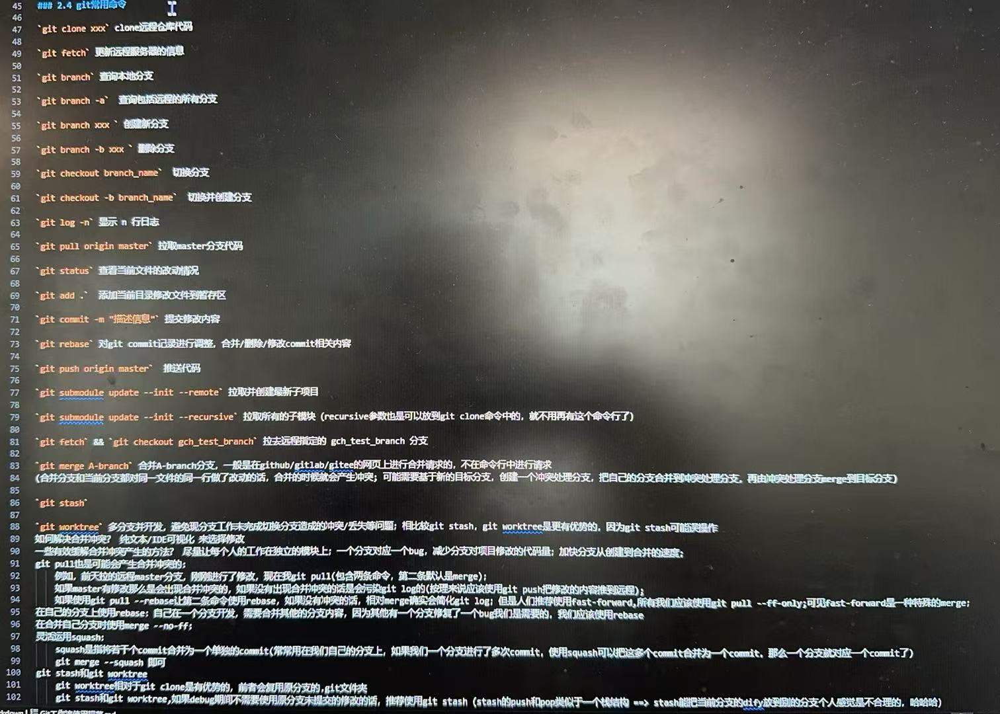

# linux,shell脚本语言，python脚本语言

clear 清屏

## git bash

pwd 查看当前路径

cd path：去指定的path路径

shift insert 粘贴 = ctrl c

ctrl insert 复制 = ctrl v

ctrl w,e,r,y 关闭浏览器(vscode)页面       a,s,d,f      z,x,c,v

shift table，table

git config --global user.email "you@example.com"

git config --global user.name "Your Name"


git clone https://gitee.com/YUANSILE/nlbq.git --recursive 拉取远程code仓库（看项d目目录是否有.gitmodules文件，里面是否有内容... git 加上 --recursive 选项）

## gitbash 使用步骤

```shell
# 1. 进入项目
ASUS@LAPTOP-6UMOON1O MINGW64 ~ (master)
$ cd D:/project/nlbq

# 2. 查看项目有什么修改
ASUS@LAPTOP-6UMOON1O MINGW64 /d/project/nlbq (master)
$ git status .
On branch master
Your branch is up to date with 'origin/master'.

Changes not staged for commit:
  (use "git add <file>..." to update what will be committed)
  (use "git restore <file>..." to discard changes in working directory)
        modified:   git.md

no changes added to commit (use "git add" and/or "git commit -a")

# 3. git add 指定文件
# 4. git commit -m "提交信息"
# 5. git push
```

## 常用git命令
    
git status . 查看当前路径下项目改动情况
    git commit -m "第一次commit" 回撤git rebase -i HEAD~1, p改为d
    
    git add . 回撤git restore --staged .

    git push 推送到远程 回撤git rebase -i HEAD~1, p改为d

git log 查看commit 记录；git log -num 最近num次的commit记录；git log --graph --oneline --all --decorate 以树状结构显示所有分支的提交历史

## git branch分支操作

git branch trw 创建trw分支;
    
```shell
ASUS@LAPTOP-6UMOON1O MINGW64 /d/project/nlbq (trw)
$ git branch # 查看当前在什么分支： * 指定分支
master
* trw
```

git checkout trw 切换到 trw分支

在trw新分支，执行git push，一般现象：

```shell
ASUS@LAPTOP-6UMOON1O MINGW64 /d/project/nlbq (trw)
$ git push
fatal: The current branch trw has no upstream branch.
To push the current branch and set the remote as upstream, use

    git push --set-upstream origin trw

To have this happen automatically for branches without a tracking
upstream, see 'push.autoSetupRemote' in 'git help config'.


ASUS@LAPTOP-6UMOON1O MINGW64 /d/project/nlbq (trw)
$ git push --set-upstream origin trw # 新分支推送远程，一般只执行一次
Enumerating objects: 5, done.
Counting objects: 100% (5/5), done.
Delta compression using up to 16 threads
Compressing objects: 100% (3/3), done.
Writing objects: 100% (3/3), 676 bytes | 676.00 KiB/s, done.
Total 3 (delta 1), reused 0 (delta 0), pack-reused 0 (from 0)
remote: Powered by GITEE.COM [1.1.23]
remote: Set trace flag c345dc8f
remote: Create a pull request for 'trw' on Gitee by visiting:
remote: https://gitee.com/YUANSILE/nlbq/pull/new/YUANSILE:trw...YUANSILE:master
To https://gitee.com/YUANSILE/nlbq.git
 * [new branch]      trw -> trw
branch 'trw' set up to track 'origin/trw'.

ASUS@LAPTOP-6UMOON1O MINGW64 /d/project/nlbq (trw)
$
```

trw 分支合并(merge)到master分支: 去mater分支，执行git merge trw

## git rebase

删除commit

合并commit

修改commit，提交信息


## 总结



